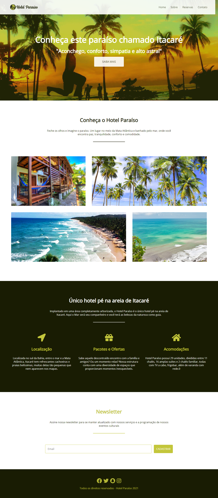

<h1> FlexboxProject_NodeStudioTreinamentos </h1>

<h2> Project built for studying CSS Flexbox concepts throughout <strong>Node Studio Treinamento</strong> channel´s playlist</h2>

Study and application of CSS Flexbox concepts in a real project. Using the technology´s main properties in practice.

<h3>Extra insights aquired:</h3>
<ul>
  <li>Create hero effects with images</li>
  <li>Use imgs as div´s backgrounds for responsiveness</li>
  <li>Use of fontawesome´s icons</li>
  <li>Creation of forms with inputs, labels and buttons</li>
</ul>

<a target="_blank" href="https://www.youtube.com/playlist?list=PLwXQLZ3FdTVGjLmjwfRc0Q9TA5U-PCWp4">Playlist link here!</a>

